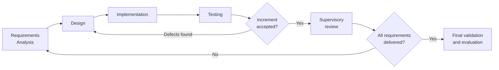
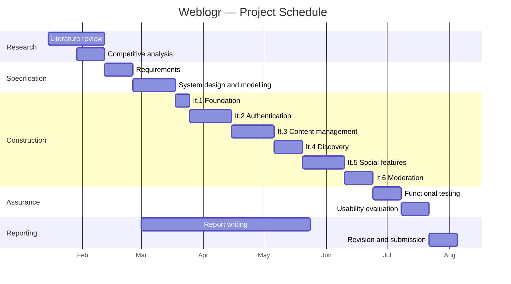

# Chapter 3 — Methodology

## 3.1 Introduction

This chapter states and justifies the methodological decisions governing the project. It
covers the software development process model (3.2), the requirements elicitation
approach (3.3), the architectural and technology decisions (3.4 and 3.5), the
verification and validation strategy (3.6), the research methods used for evaluation
(3.7), ethical considerations (3.8), the tools employed (3.9), and the project schedule
and risk management (3.10).

Each decision is presented with the alternatives considered and the criteria applied, so
that the reasoning can be assessed independently of the outcome. Where a decision proved
suboptimal in retrospect, this is stated here and analysed in Chapter 8 rather than
concealed.

## 3.2 Software Development Process Model

### 3.2.1 Candidate Models

Three process models were evaluated.

**Waterfall.** Sequential phases with formal sign-off between each. Its strength is
documentation discipline and predictability, which suit projects with stable, fully
understood requirements. Its weakness is rigidity: requirements are frozen before design
begins, and the cost of change rises sharply with each phase boundary crossed.

**Scrum.** An agile framework structuring work into fixed-length sprints with defined
roles — Product Owner, Scrum Master, Development Team — and ceremonies including sprint
planning, daily stand-ups, review and retrospective. Its strengths are responsiveness to
change and frequent delivery of working increments. Its role structure presupposes a
team and a stakeholder able to prioritise on behalf of users.

**Iterative and incremental development.** The system is built in repeated cycles, each
producing a working increment that adds capability to the previous one. Each cycle
performs analysis, design, implementation and testing on a subset of requirements. It
retains agile responsiveness without Scrum's role apparatus.

### 3.2.2 Selection and Justification

**Iterative and incremental development was selected.**

Waterfall was rejected because the requirements were not fully understood at the outset.
The comparative analysis in Section 2.5 shaped the feature set, and several requirements
— notably the notification subsystem's scope and the draft workflow's behaviour — were
refined only once earlier increments made their implications concrete. Freezing the
specification before design would have forced either an inaccurate specification or an
undocumented departure from it.

Scrum was rejected on grounds of team size. Its roles and ceremonies presuppose a team
of several developers and an external Product Owner. A single-developer project cannot
meaningfully separate these roles, and adopting the ceremonial structure without the
team would have produced process theatre rather than process benefit. Claiming to have
"followed Scrum" as a sole developer is a common and easily challenged overstatement,
and it is avoided here deliberately.

Iterative and incremental development matched the project's actual conditions: a single
developer, evolving requirements, a fixed deadline, and a supervisor providing periodic
review rather than continuous stakeholder engagement. It also aligns with the assessment
structure, in which supervisory meetings occur at intervals and provide natural iteration
boundaries.

### 3.2.3 Iteration Structure

Six iterations were planned. Each proceeded through analysis, design, implementation and
test of a coherent subset of requirements, concluding with a working increment and a
supervisory review.

**Figure 3.1 — Iterative and incremental development process**

| Iteration | Requirements delivered | Increment |
|---|---|---|
| 1 | Foundation | Database schema; connection layer; static landing page; stylesheet foundation |
| 2 | FR-01 to FR-06 | Registration, email OTP verification, login, logout, password recovery |
| 3 | FR-07 to FR-12 | Post creation with image upload, draft workflow, editing, deletion |
| 4 | FR-13 to FR-15 | Feed with category, author, date and popularity filtering |
| 5 | FR-16 to FR-20 | Comments, likes, following, notification fan-out |
| 6 | FR-21 to FR-23 | Profiles, content reporting, administrative moderation |

Section 3.10 presents the schedule against which these iterations were executed.

## 3.3 Requirements Elicitation

No external client existed for this project, so requirements were derived from three
sources rather than from stakeholder interview.

**Competitive analysis.** The structured comparison of four related systems in Section
2.5 established the capabilities users of comparable platforms expect. Table 2.1 is the
direct antecedent of the functional requirement set: features present in a majority of
the compared systems were treated as baseline expectations, and features absent from
lightweight self-hosted systems were treated as differentiators.

**Literature-derived quality requirements.** The security framework in Section 2.3 and
the usability and accessibility principles in Section 2.4 generated non-functional
requirements independently of any feature comparison. The mapping is given explicitly in
Section 2.7.

**Persona-based scenario analysis.** Three personas were constructed to represent the
target user described in Section 1.2, and used to reason about the workflows the system
must support:

- *The individual author* — publishes occasionally, wants control of content and
  presentation, has limited technical capacity for maintenance. Drives the requirements
  for straightforward authoring, drafts and profile management.
- *The engaged reader* — reads regularly, comments and follows authors. Drives the
  requirements for discovery, filtering, commenting, liking and following.
- *The community moderator* — maintains standards within a small community. Drives the
  requirements for reporting and administrative moderation.

Requirements were prioritised using **MoSCoW** — Must have, Should have, Could have,
Won't have — with prioritisation recorded in Tables 4.1 and 4.2. The Won't-have set is
recorded in Section 1.4.2 with rationale, so that scope decisions are auditable rather
than implicit.

## 3.4 Architectural Decision: Framework-Free Implementation

This is the project's most consequential technical decision and is stated here in full,
with its costs, because Chapters 6 and 8 return to it repeatedly.

### 3.4.1 The Decision

Weblogr is implemented in PHP without an application framework. Requests are served by
individual PHP scripts, each handling one user action from input through persistence to
response — the Transaction Script pattern described in Section 2.2.2.

### 3.4.2 Alternatives Considered

**Laravel.** A full-stack PHP framework providing Eloquent ORM, Blade templating, a
routing layer, middleware, automatic CSRF protection, authentication scaffolding, and
database migrations. It would have supplied by default a substantial proportion of the
security requirements in Section 2.7.

**CodeIgniter.** A lighter PHP framework offering MVC structure, a query builder and
basic security helpers, with a shallower learning curve than Laravel.

**Vanilla PHP.** No framework.

### 3.4.3 Justification

Three arguments supported the decision at the time it was taken.

*Pedagogical transparency.* A framework abstracts request routing, query construction,
output escaping and session handling behind conventions. Building without one required
implementing and therefore understanding each mechanism directly. For a final year
project whose purpose includes demonstrating understanding of web application
fundamentals, this is a defensible position: the mechanisms are visible in the source
and can be examined and discussed rather than delegated.

*Deployment simplicity.* Section 2.7 derives a requirement for minimal deployment
complexity from the analysis of WordPress's maintenance burden. A framework-based
application requires Composer for dependency installation and carries a substantial
vendor tree that must be kept patched. Weblogr's application code requires only a PHP
runtime and a MySQL-compatible database. Composer is used for one library only —
PHPMailer, for SMTP — and the deployment consists of copying files and importing a schema.

*Scope proportionality.* The system comprises twenty-three functional requirements
across eight entities, and the logic is predominantly CRUD-shaped. Fowler (2002)
identifies exactly this profile as the domain where Transaction Script is appropriate
and where the investment in a Domain Model is not repaid.

### 3.4.4 Costs Accepted

The decision was taken with the following costs understood and accepted. They are stated
here rather than in the conclusion because a decision presented without its costs is not
a justified decision.

1. **Every security control becomes the developer's responsibility.** Parameterised
   queries, output escaping, CSRF tokens, session hardening and authorisation checks are
   supplied automatically or by default in Laravel; here each must be implemented
   correctly at every relevant point in the code. Correctness by construction is replaced
   by correctness by discipline, and discipline does not scale uniformly across
   twenty-eight scripts written over several months.

2. **Cross-cutting concerns cannot be centralised.** Without middleware there is no
   single place to enforce authentication, so the check must be repeated in every
   protected script — and an omission in any one of them is a vulnerability.

3. **Logic is not separable from presentation, and therefore not unit-testable.** With
   database access and markup generation interleaved in the same file, there is no unit
   to test in isolation. Chapter 6's reliance on manual functional testing rather than
   automated unit testing is a direct consequence of this decision.

4. **Duplication is likely.** Fowler predicts it for Transaction Script, and Section
   8.2.1 measures it in the delivered system.

Chapter 6 reports empirically how far these risks materialised, and Section 8.2.2
assesses whether the decision was, on the evidence, correct. Anticipating that
discussion: the pedagogical and deployment arguments held, while cost (1) proved
substantially more damaging than anticipated at the time of the decision.

## 3.5 Technology Selection

| Layer | Selected | Alternatives considered | Rationale |
|---|---|---|---|
| Server language | PHP 8.2 | Node.js, Python (Django/Flask), Java | Ubiquitous shared-hosting support directly serves the deployment-simplicity requirement; mature MySQL integration; existing developer familiarity permitting focus on design rather than language acquisition |
| Database | MariaDB 10.4 (MySQL-compatible) | PostgreSQL, SQLite | Relational model required by the normalised design (§2.2.4); ACID transactions; ubiquitous availability alongside PHP; PostgreSQL rejected only for hosting ubiquity, not on technical merit; SQLite rejected for concurrent-write limitations |
| Database interface | `mysqli` (object-oriented) | PDO | Native MySQL feature support; prepared statement support meeting the §2.7 injection requirement. **PDO would have been the better choice** — its uniform interface across drivers and consistent exception-based error handling would have improved portability and error management. This is acknowledged in §8.3.6 |
| Client-side | HTML5, CSS3, vanilla JavaScript | React, Vue, jQuery | Interaction requirements are predominantly form submission and navigation; a client-side framework would add a build toolchain and runtime dependency without corresponding benefit, contradicting the deployment-simplicity requirement |
| Email | PHPMailer 6.9 | PHP `mail()`, SendGrid API | Authenticated SMTP with TLS, required for reliable delivery; `mail()` lacks authentication support and is widely filtered as spam; SendGrid would introduce an external service dependency and API key management |
| Iconography | Font Awesome 5.15 | Custom SVG, Bootstrap Icons | Comprehensive icon set, CDN-delivered, no build step |
| Web server | Apache (XAMPP) | Nginx | Standard PHP development stack; `.htaccess` support useful for directory-level configuration |
| Version control | Git | Subversion, Mercurial | Industry standard; distributed model suits single-developer work |

## 3.6 Verification and Validation Strategy

Verification asks whether the system was built correctly against its specification;
validation asks whether the right system was built. Both are addressed.

**Verification** is performed through the functional test suite documented in Chapter 6.
Test cases were derived from the functional requirements, giving requirement-to-test
traceability (Table 6.4), and use black-box techniques — equivalence partitioning,
boundary value analysis and error guessing — described in Section 6.2. Testing covers
positive paths, negative paths and boundary conditions. A separate security assessment
(Section 6.6) evaluates the system against the OWASP framework established in Section
2.3.1.

**Validation** is performed through the usability evaluation in Chapter 7, in which
representative users attempt realistic tasks and rate the system using a standardised
instrument.

**On the absence of automated testing.** No unit test suite exists. This is a direct
consequence of the architectural decision in Section 3.4: business logic is not
separable from data access and presentation, so there is no unit available to test in
isolation. The honest statement of this dependency is preferred to a retrospective claim
that automated testing was considered unnecessary. Section 8.4 identifies the
refactoring — extraction of logic into testable functions — that would be a precondition
for introducing it.

## 3.7 Research Methods for Evaluation

The usability evaluation uses a **mixed-methods** design combining quantitative and
qualitative data. The rationale is that neither alone is sufficient: quantitative
measures establish *that* a difficulty exists and permit comparison against published
benchmarks, while qualitative observation establishes *why* it exists and what would
resolve it.

**Quantitative instruments:**
- System Usability Scale (Brooke, 1996) — a validated ten-item questionnaire yielding a
  0–100 score interpretable against published norms (§2.4.2).
- Task completion rate — the proportion of assigned tasks completed successfully without
  intervention.
- Time on task — elapsed time per task, measured from task start to completion.
- Error rate — the count of incorrect actions per task.

**Qualitative instruments:**
- Concurrent think-aloud protocol during task performance.
- Semi-structured post-task interview.
- Observer notes recording hesitations, backtracking and requests for assistance.

**Sampling.** Purposive sampling of participants matching the personas in Section 3.3.
The sample is small, consistent with formative usability evaluation practice (§2.4.2).

**A statement on statistical inference.** The sample size is appropriate for identifying
usability problems but is too small to support inferential statistics. No significance
testing is performed and no claims of statistical generalisation to a wider population
are made. Chapter 7 reports descriptive statistics — mean, median, standard deviation
and range — and interprets the SUS mean against published benchmarks while stating the
associated confidence interval, which is necessarily wide. This limitation is restated
in Section 8.3.7. Presenting small-sample results as though they supported population
inference would be a methodological error, and it is avoided deliberately.

## 3.8 Ethical Considerations

The usability evaluation involves human participants and is conducted accordingly.

**[[ACTION: Confirm your institution's requirements. Most departments require ethics
approval before any study involving human participants, even low-risk usability testing.
Obtain approval BEFORE recruiting, and record the reference number here. If you run the
study without approval you may be unable to report the results.]]**

- **Ethics approval:** [[ACTION: Reference number and approval date]]
- **Informed consent.** Participants receive a written information sheet describing the
  study's purpose, procedure, duration and data handling, and sign a consent form before
  participating. Templates are in Appendix D.
- **Right to withdraw.** Participants may withdraw at any point without giving a reason
  and without consequence, and may request destruction of their data after the session.
- **Anonymity.** Participants are identified only as P1, P2 … Pn. No names, contact
  details or other identifying information appear in this report or in the analysis
  data. No audio or video recording is made.
- **Data protection.** Data is limited to task performance measures, questionnaire
  responses and anonymised notes. It is stored on encrypted storage, used solely for
  this project's assessment, and destroyed after the assessment period concludes.
- **Test environment.** The study is conducted against a separate instance populated
  with synthetic data. Participants do not use real credentials and no real personal
  data is processed.
- **Risk.** The study presents no physical risk and minimal psychological risk.
  Participants are briefed explicitly that the system is under evaluation and that any
  difficulty encountered reflects a deficiency in the system rather than in the
  participant — a standard measure to reduce evaluation apprehension.

**Note on the artefact's own data protection posture.** The system stores personal data
(email addresses, names, biographies) and would, in real deployment, engage data
protection obligations including lawful basis for processing, subject access, erasure
and breach notification. The prototype implements none of these. This is recorded as a
limitation in Section 8.3.8 rather than being passed over silently.

## 3.9 Development Tools

| Purpose | Tool |
|---|---|
| Local server stack | XAMPP (Apache, MariaDB, PHP 8.2) |
| Code editor | [[ACTION: VS Code / PhpStorm / other]] |
| Database administration | phpMyAdmin |
| Version control | Git, hosted on [[ACTION: GitHub/GitLab]] |
| Dependency management | Composer (PHPMailer only) |
| Diagram authoring | [[ACTION: draw.io / Mermaid / PlantUML]] |
| Browser testing | [[ACTION: list browsers and versions used]] |
| Markup validation | W3C Markup Validation Service |
| Report preparation | [[ACTION: Word / LaTeX]] |

**On version control practice.** The repository history does not reflect the iterative
process described in Section 3.2.3, as the codebase was committed in a small number of
large commits rather than incrementally. This is a departure from good practice: a
granular history provides both a recoverable development record and evidence of process.
It is recorded here as a process limitation in Section 8.3.9 and the corresponding
lesson is stated in Section 8.5.

## 3.10 Project Schedule and Risk Management

### 3.10.1 Schedule

**Figure 3.2 — Project timeline**

**[[ACTION: Replace these dates with your actual project dates. Examiners sometimes
cross-check the Gantt chart against supervisory meeting records.]]**

### 3.10.2 Risk Register

| ID | Risk | Likelihood | Impact | Mitigation | Outcome |
|---|---|---|---|---|---|
| R1 | SMTP delivery unreliable, blocking registration testing | Medium | High | Use authenticated SMTP via PHPMailer; retain a database-level verification path for testing | Materialised partially; mitigated |
| R2 | Scope expansion beyond available time | High | High | MoSCoW prioritisation; explicit Won't-have list (§1.4.2) | Controlled |
| R3 | Data loss during development | Low | High | Version control; periodic database export | Did not materialise |
| R4 | Security defects in framework-free implementation | **High** | **High** | Parameterised statements; security review against OWASP (§6.6) | **Materialised — see §6.6 and §8.2** |
| R5 | Insufficient participant recruitment for evaluation | Medium | Medium | Recruit early; small sample sufficient for formative evaluation (§2.4.2) | [[ACTION: record outcome]] |
| R6 | Underestimation of report writing effort | Medium | High | Begin writing in parallel with construction | [[ACTION: record outcome]] |

Risk R4 is highlighted because it was identified at the outset as the principal risk of
the architectural decision in Section 3.4, and it did materialise. Chapter 6 quantifies
the extent, and Section 8.2 analyses why the stated mitigation proved insufficient. A
risk register that records only risks which did not occur is of no analytical value;
the value here lies in the fact that the project's own risk analysis correctly predicted
its principal weakness.
