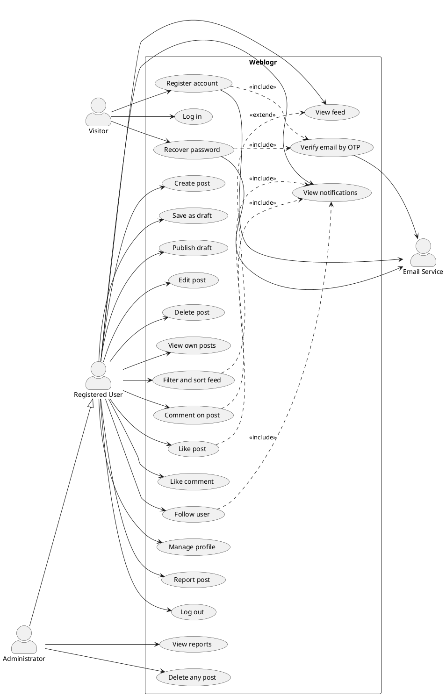
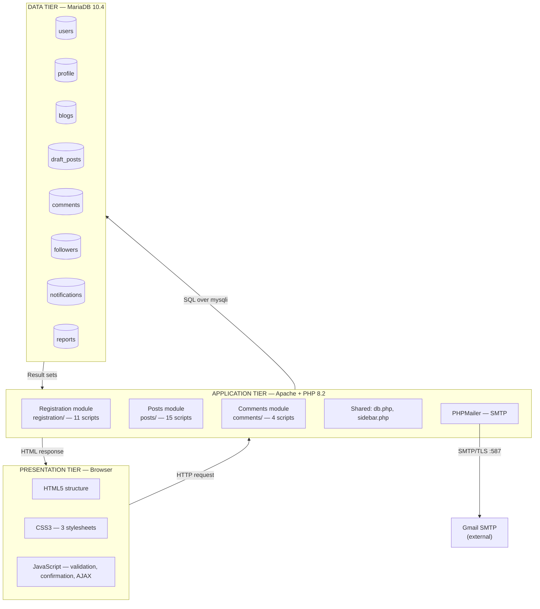
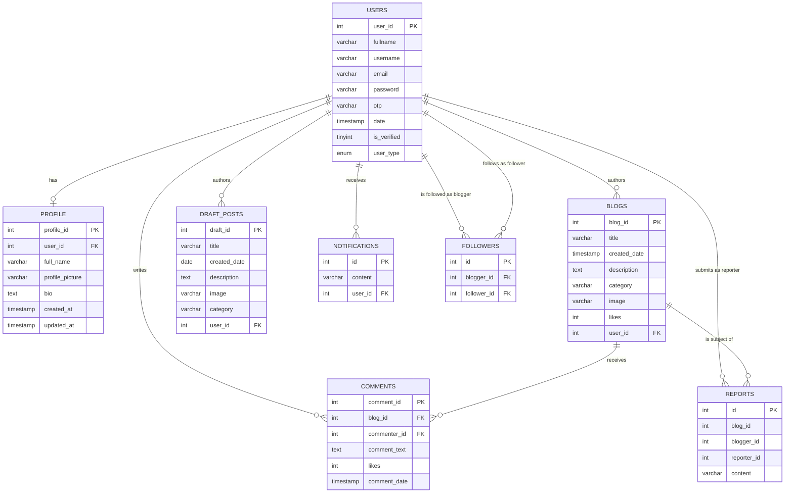
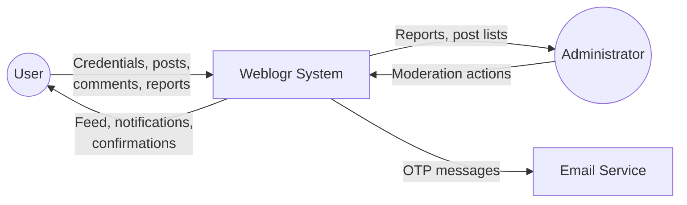
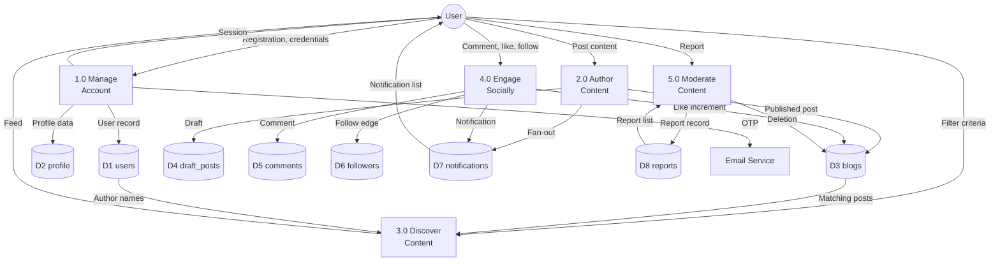
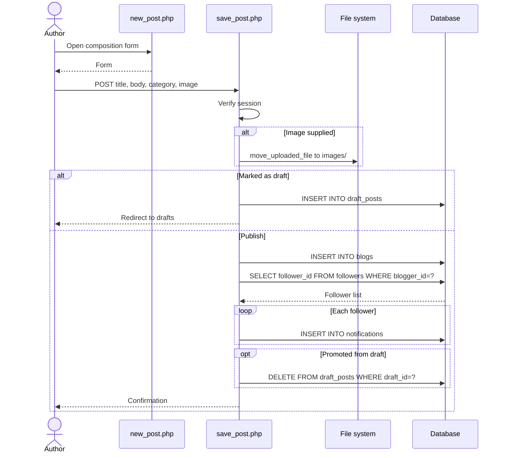
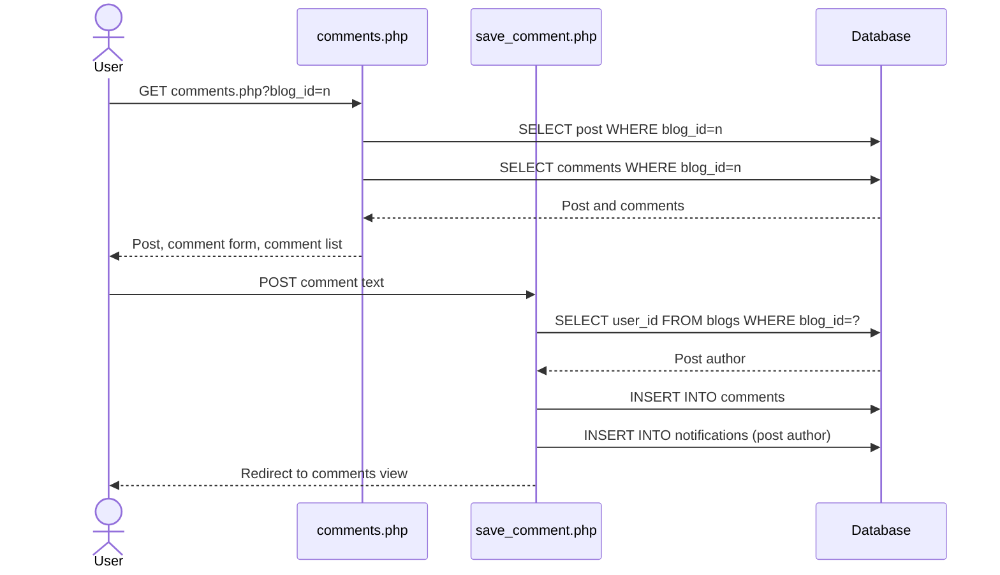
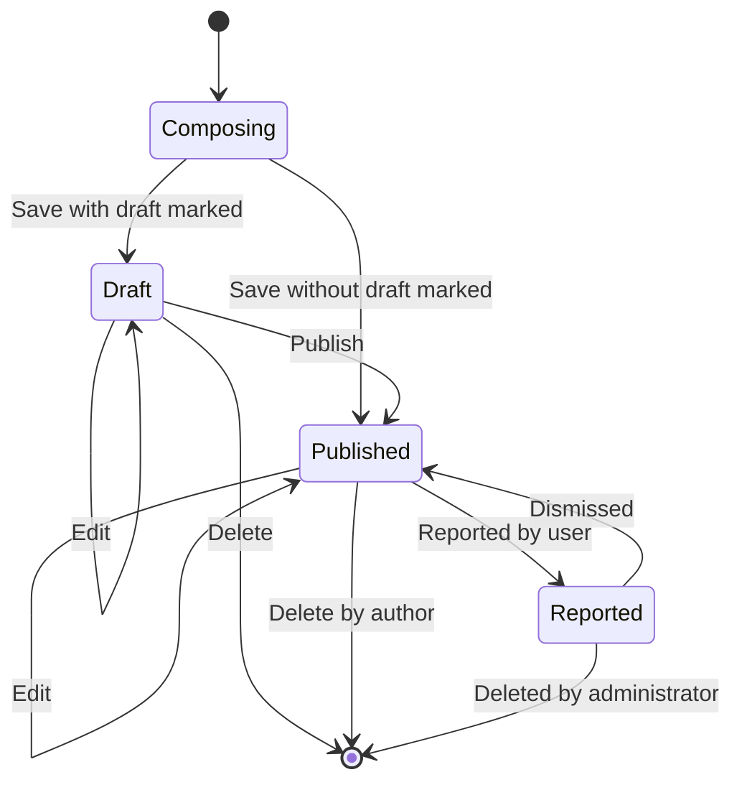
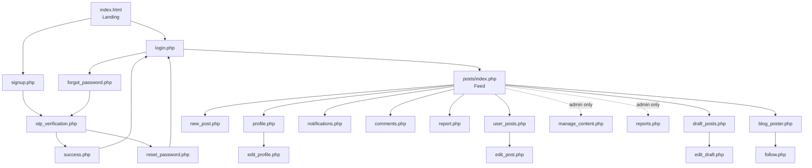

# Chapter 4 — Requirements and System Design

## 4.1 Introduction

This chapter specifies what Weblogr does and how it is structured to do it. Section 4.2
presents the requirements specification. Sections 4.3 to 4.5 model system behaviour and
architecture. Section 4.6 presents the data design. Sections 4.7 and 4.8 cover process
and interface design. Section 4.9 records design decisions that in retrospect were
suboptimal, so that Chapter 8's critical evaluation rests on an explicit account rather
than a retrospective reconstruction.

## 4.2 Requirements Specification

Requirements are prioritised using MoSCoW (§3.3) and traced to their source: the
competitive analysis (§2.5), the security review (§2.3), or the usability review (§2.4).

### 4.2.1 Functional Requirements

**Table 4.1 — Functional requirements**

| ID | Requirement | Priority | Source |
|---|---|---|---|
| FR-01 | A visitor shall register by supplying full name, username, email address and password | Must | §2.5.5 |
| FR-02 | The system shall verify a registrant's email address by sending a six-digit one-time password that the registrant must enter to activate the account | Must | §2.3.2 |
| FR-03 | The system shall reject registration where the username or email address is already associated with a verified account | Must | §2.5.5 |
| FR-04 | A registered user shall authenticate using username and password | Must | §2.5.5 |
| FR-05 | A user shall recover access by requesting a one-time password sent to their registered email address, and set a new password on verification | Must | §2.3.2 |
| FR-06 | A user shall terminate their session | Must | §2.3.2 |
| FR-07 | An authenticated user shall create a post comprising a title, body text, an optional image and one category | Must | §2.5.5 |
| FR-08 | A user shall save a post as a private draft visible only to its author | Should | §2.5.5 |
| FR-09 | A user shall publish a draft, whereupon it becomes visible in the feed and ceases to be a draft | Should | §2.5.5 |
| FR-10 | A user shall edit the title, body, image and category of a post they authored | Must | §2.5.5 |
| FR-11 | A user shall delete a post they authored, together with its dependent comments | Must | §2.5.5 |
| FR-12 | A user shall view a list of the posts they have authored | Must | §2.5.5 |
| FR-13 | An authenticated user shall view a feed of all published posts in reverse chronological order | Must | §2.5.5 |
| FR-14 | A user shall filter the feed by category and by author | Should | §2.5.5 |
| FR-15 | A user shall sort the feed by publication date or by like count | Should | §2.5.5 |
| FR-16 | A user shall comment on any post | Must | §2.5.5 |
| FR-17 | A user shall like a post | Must | §2.5.5 |
| FR-18 | A user shall like a comment | Could | §2.5.5 |
| FR-19 | A user shall follow another user | Should | §2.5.5 |
| FR-20 | The system shall notify a user when another user follows them, comments on their post, likes their post, or likes their comment; and shall notify a user's followers when that user publishes a post | Should | §2.5.5 |
| FR-21 | A user shall maintain a profile comprising display name, biography and profile image, and shall view counts of their posts, followers and accounts followed | Should | §2.5.5 |
| FR-22 | A user shall report a post as inappropriate, supplying a reason | Should | §2.5.5 |
| FR-23 | An administrator shall view submitted reports and delete any post | Should | §2.5.5 |

### 4.2.2 Non-Functional Requirements

**Table 4.2 — Non-functional requirements**

| ID | Category | Requirement | Priority | Source |
|---|---|---|---|---|
| NFR-01 | Security | Passwords shall be stored as salted adaptive hashes, never in plaintext or as fast general-purpose digests | Must | §2.3.2 |
| NFR-02 | Security | All database access incorporating external input shall use parameterised statements | Must | §2.3.1 A03 |
| NFR-03 | Security | All user-supplied data shall be contextually encoded on output | Must | §2.3.1 |
| NFR-04 | Security | Every request accessing or modifying a user-owned resource shall verify, server-side, that the authenticated user is entitled to it | Must | §2.3.1 A01 |
| NFR-05 | Security | State-changing requests shall use POST and carry a session-bound CSRF token | Must | §2.3.1 |
| NFR-06 | Security | Uploaded files shall be validated by extension allow-list and content-based type inspection, stored under a server-generated name, and subject to a size limit | Must | §2.3.3 |
| NFR-07 | Usability | The interface shall provide feedback for every user action within one second | Should | §2.4.1 |
| NFR-08 | Usability | Destructive actions shall require confirmation | Should | §2.4.1 |
| NFR-09 | Performance | Any page shall render within two seconds under the expected load (§1.4.3) | Should | — |
| NFR-10 | Performance | The system shall continue to meet NFR-09 under the concurrent load implied by §1.4.3 | Should | — |
| NFR-11 | Usability | The interface shall remain usable at viewport widths of 768 px and above | Should | §2.4.1 |
| NFR-12 | Accessibility | The interface shall satisfy WCAG 2.1 Level A for text alternatives, keyboard operability and input labelling | Could | §2.4.3 |
| NFR-13 | Compatibility | The system shall function correctly in current versions of Chrome, Firefox and Edge | Should | — |
| NFR-14 | Maintainability | Source shall be organised into modules by functional area with consistent naming | Should | §2.2.2 |

Chapter 6 reports satisfaction against every requirement in both tables. Several
security requirements were not met in the delivered implementation; they are stated here
as specified rather than being retrospectively weakened to match what was built.

## 4.3 Use Case Model

### 4.3.1 Actors

| Actor | Description |
|---|---|
| **Visitor** | An unauthenticated party. May view the landing page, register and authenticate. |
| **Registered User** | An authenticated party with a verified account. Exercises all authoring, discovery and social capabilities. |
| **Administrator** | A registered user with elevated privileges, distinguished by `users.user_type`. Additionally views reports and removes any post. |
| **Email Service** | External SMTP service delivering verification and recovery messages. |

**Figure 4.1 — Use case diagram**



### 4.3.2 Use Case Specifications

Two use cases are specified in full; the remainder follow the same pattern and are
recorded in Appendix A.

**UC1 — Register account**

| Field | Content |
|---|---|
| **Actor** | Visitor |
| **Goal** | Create a verified account |
| **Precondition** | The visitor has an email address they control and is not authenticated |
| **Postcondition** | A user record exists with `is_verified = 1`; the visitor may authenticate |
| **Main flow** | 1. Visitor opens the registration form. 2. Visitor supplies full name, email, username, password and password confirmation. 3. System validates that all fields are present and the passwords match. 4. System confirms the username and email are not already associated with a verified account. 5. System generates a six-digit OTP. 6. System hashes the password with bcrypt. 7. System stores the user record with `is_verified = 0`. 8. System sends the OTP to the supplied address. 9. Visitor enters the OTP. 10. System compares the entered value with the stored value. 11. System sets `is_verified = 1` and clears the stored OTP. 12. System confirms success and offers login. |
| **A1 — Username taken** | At step 4, system reports that the username is taken and returns to step 2 |
| **A2 — Email registered** | At step 4, system reports that the email is registered and returns to step 2 |
| **A3 — Passwords differ** | At step 3, client-side validation reports the mismatch and returns to step 2 |
| **E1 — Delivery failure** | At step 8, system reports the failure and offers retry |
| **E2 — Incorrect OTP** | At step 10, system reports the mismatch and returns to step 9 |

**UC6 — Create post**

| Field | Content |
|---|---|
| **Actor** | Registered User |
| **Goal** | Publish a post visible in the feed |
| **Precondition** | Actor is authenticated |
| **Postcondition** | A `blogs` record exists attributed to the actor; each follower has a notification |
| **Main flow** | 1. Actor opens the composition form. 2. Actor supplies title, body and category, and optionally selects an image. 3. Actor submits without marking the draft option. 4. System validates that required fields are present. 5. System stores the image if supplied. 6. System inserts the post with the current timestamp and the actor's identifier. 7. System retrieves the actor's followers. 8. System inserts a notification for each follower. 9. System confirms publication. |
| **A1 — Saved as draft** | At step 3, actor marks the draft option; system stores to `draft_posts` and omits steps 7–8 |
| **A2 — No image** | At step 5, the post is stored without an image reference |
| **E1 — Insert fails** | At step 6, system reports the failure and retains the entered content |

## 4.4 System Architecture

**Figure 4.2 — Three-tier system architecture**



### 4.4.1 Tier Responsibilities

**Presentation tier.** Renders markup, applies styling, and performs client-side
validation and confirmation dialogues. Client-side validation is a usability measure
providing immediate feedback (NFR-07); it is not a security control, as it is trivially
bypassed. Server-side validation is therefore required independently — a principle whose
observance in the implementation is examined in Section 6.6.

**Application tier.** Twenty-eight PHP scripts organised into three functional modules
plus shared includes. Each script handles one user action: it reads request parameters,
enforces authentication, performs data access, and emits the response.

**Data tier.** Eight tables in MariaDB. Referential integrity is enforced by foreign key
constraints where declared; Section 4.6.5 records where this is incomplete.

### 4.4.2 Module Structure

| Module | Directory | Responsibility | Scripts |
|---|---|---|---|
| Registration | `registration/` | Account lifecycle, authentication, profile | 11 |
| Posts | `posts/` | Content authoring, discovery, social graph, moderation | 15 |
| Comments | `comments/` | Commenting and like handling | 4 |
| Database | `database/` | Connection establishment, schema definition | 2 |
| Assets | `styles/`, `images/`, `uploads/` | Stylesheets, post images, profile images | — |

The module boundary is by functional area, satisfying NFR-14. Note that
`comments/likes.php` handles post likes rather than comment likes, a naming
inconsistency recorded in Section 4.9.

## 4.5 Architectural Pattern

The system implements the **Transaction Script** pattern (Fowler, 2002; §2.2.2): each
script services one user action from request to response. Section 3.4 justifies this
choice and states its accepted costs.

The pattern's principal consequence for the design presented in this chapter is that
there is no controller layer in which cross-cutting concerns can be centralised.
Authentication, in particular, must be enforced by an identical guard repeated at the
head of every protected script:

```php
session_start();
if (!isset($_SESSION["username"])) {
    header("Location: ../registration/login.php");
    exit;
}
```

The correctness of the system's access control therefore depends on this guard being
present, correct and complete in every script that requires it. Section 6.6.1 reports
the audit of that property across all twenty-eight scripts.

## 4.6 Data Design

### 4.6.1 Entity Relationship Diagram

**Figure 4.3 — Entity relationship diagram**



### 4.6.2 Data Dictionary

**Table 4.3 — Data dictionary** (abridged; full version in Appendix B)

**`users`** — account credentials and status

| Attribute | Type | Constraints | Description |
|---|---|---|---|
| `user_id` | INT | PK, AUTO_INCREMENT | Surrogate key |
| `fullname` | VARCHAR(25) | NOT NULL | Name given at registration |
| `username` | VARCHAR(255) | NOT NULL | Login identifier |
| `email` | VARCHAR(255) | NOT NULL | Address for verification and recovery |
| `password` | VARCHAR(255) | NOT NULL | bcrypt hash (60 chars; field sized for algorithm migration) |
| `otp` | VARCHAR(10) | NOT NULL | Current one-time password |
| `date` | TIMESTAMP | DEFAULT CURRENT_TIMESTAMP | Registration time |
| `is_verified` | TINYINT(1) | DEFAULT 0 | Email verification status |
| `user_type` | ENUM | DEFAULT 'Common user' | 'Common user' or 'Admin' |

**`blogs`** — published posts

| Attribute | Type | Constraints | Description |
|---|---|---|---|
| `blog_id` | INT | PK, AUTO_INCREMENT | Surrogate key |
| `title` | VARCHAR(255) | NOT NULL | Post title |
| `created_date` | TIMESTAMP | DEFAULT CURRENT_TIMESTAMP ON UPDATE CURRENT_TIMESTAMP | Publication time |
| `description` | TEXT | NULL | Body text |
| `category` | VARCHAR(15) | NOT NULL | One of seven category values |
| `image` | VARCHAR(255) | NULL | Image filename |
| `likes` | INT | DEFAULT 0 | Materialised like count |
| `user_id` | INT | NULL | Author |

**`comments`** — comments on posts

| Attribute | Type | Constraints | Description |
|---|---|---|---|
| `comment_id` | INT | PK, AUTO_INCREMENT | Surrogate key |
| `blog_id` | INT | FK → `blogs` | Post commented on |
| `commenter_id` | INT | FK → `users` | Author of comment |
| `comment_text` | TEXT | NULL | Comment body |
| `likes` | INT | NOT NULL | Materialised like count |
| `comment_date` | TIMESTAMP | DEFAULT CURRENT_TIMESTAMP | Submission time |

**`followers`** — the follow graph

| Attribute | Type | Constraints | Description |
|---|---|---|---|
| `id` | INT | PK, AUTO_INCREMENT | Surrogate key |
| `blogger_id` | INT | FK → `users` | User being followed |
| `follower_id` | INT | FK → `users` | User following |

### 4.6.3 Normalisation Analysis

The schema is analysed against the normal forms defined in Section 2.2.4.

**1NF.** All attributes are atomic and no repeating groups exist. Multi-valued
relationships — a user's followers, a post's comments — are represented as separate
relations rather than as repeated columns. **Satisfied.**

**2NF.** Every relation has a single-attribute surrogate primary key, so no partial
dependency on a composite key is possible. **Satisfied trivially.**

**3NF.** No transitive dependencies exist among non-key attributes within any relation.
Author information is referenced by `user_id` rather than duplicated into `blogs`.
**Satisfied, with two deliberate departures:**

- `blogs.likes` and `comments.likes` are materialised counters. The count is derivable
  by aggregation and its storage is therefore redundant. The design intent was to avoid
  a `COUNT` aggregation on every feed render (§2.2.4 discusses this trade-off). Section
  4.9.2 records why this decision was mistaken in this particular case.
- `users.fullname` and `profile.full_name` both store a display name. This is
  unintentional redundancy arising from the profile relation being introduced after the
  user relation, and it creates an update anomaly: the two may diverge with no
  reconciliation mechanism. Recorded in Section 4.9.3.

### 4.6.4 Indexing Strategy

Primary keys are indexed automatically. Foreign key columns carry indexes as a
consequence of constraint declaration: `blogs.user_id`, `comments.blog_id`,
`comments.commenter_id`, `draft_posts.user_id`, `followers.blogger_id`,
`followers.follower_id`, `notifications.user_id`, `profile.user_id`.

**The design specifies additionally** that columns used for filtering and ordering
be indexed, since FR-14 and FR-15 filter on `blogs.category` and order by
`blogs.created_date` and `blogs.likes`. Without these indexes each feed request performs
a full table scan followed by a filesort. Section 6.5 measures the consequence, and
Section 8.3.1 discusses it.

### 4.6.5 Referential Integrity

Foreign key constraints are declared on `comments`, `draft_posts`, `followers`,
`notifications` and `profile`. Two gaps exist in the delivered schema:

- **`blogs.user_id` carries no foreign key constraint.** The constraint was declared and
  subsequently dropped during development; the shipped schema retains only the index.
  Author attribution therefore depends entirely on application correctness.
- **`reports` declares no foreign keys at all**, despite holding three referencing
  attributes.

No `ON DELETE` behaviour is specified on any constraint, so MySQL's default `RESTRICT`
applies: deleting a user with dependent rows fails. Section 4.9.4 discusses the intended
behaviour.

## 4.7 Process Design

**Figure 4.4 — Context diagram (DFD Level 0)**



**Figure 4.5 — Data flow diagram (Level 1)**



**Figure 4.6 — Sequence diagram: registration and OTP verification**

```mermaid
sequenceDiagram
    actor V as Visitor
    participant S as signup.php
    participant M as mail.php
    participant SMTP as Gmail SMTP
    participant O as otp_verification.php
    participant DB as Database

    V->>S: POST registration details
    S->>DB: SELECT username WHERE username=? AND is_verified=1
    DB-->>S: Result
    S->>DB: SELECT email WHERE email=? AND is_verified=1
    DB-->>S: Result
    alt Username or email already verified
        S-->>V: Reject with message
    else Available
        S->>S: Generate 6-digit OTP
        S->>S: password_hash(password, BCRYPT)
        S->>DB: INSERT user (is_verified=0)
        S->>M: Send OTP
        M->>SMTP: Authenticated SMTP over TLS
        SMTP-->>M: Accepted
        M-->>V: Redirect to OTP form
        V->>O: POST six digits
        O->>DB: SELECT otp WHERE email=? AND is_verified=0
        DB-->>O: Stored OTP
        alt Match
            O->>DB: UPDATE otp = NULL
            O->>DB: UPDATE is_verified = 1
            O-->>V: Success; offer login
        else Mismatch
            O-->>V: Error; retry
        end
    end
```

**Figure 4.7 — Sequence diagram: post publication and notification fan-out**



**Figure 4.8 — Sequence diagram: comment submission**



**Figure 4.9 — Post lifecycle state diagram**



## 4.8 Interface Design

### 4.8.1 Design Principles Applied

The interface is designed against the heuristics in Section 2.4.1.

*Consistency and standards.* A persistent left sidebar provides identical navigation on
every authenticated page, so navigation position and meaning never change between
contexts.

*Recognition rather than recall.* Filter controls on the feed are populated dropdowns
rather than free-text entry, so the user selects from visible options rather than
recalling valid values.

*Error prevention.* Required fields are marked `required`; the password confirmation
field is compared client-side before submission; destructive actions raise a confirmation
dialogue (NFR-08).

*Visibility of system status.* Actions produce a response — a confirmation, a redirect
to the affected view, or an alert.

*User control and freedom.* The draft mechanism allows composition to be suspended and
resumed; posts remain editable after publication.

### 4.8.2 Navigation Structure

**Figure 4.10 — Navigation map**



### 4.8.3 Layout and Visual Design

A fixed left sidebar carries icon-based navigation; content occupies the remaining
width. Posts are presented as discrete cards, each showing title, date, image, author
attribution, body and action controls, providing clear visual separation between items
in the feed.

Font Awesome icons denote actions throughout. Section 8.3.3 evaluates this decision
against the accessibility criteria in Section 2.4.3 and against the evaluation findings
in Chapter 7: icon-only controls without accessible text labels are dependent on the
`title` attribute alone, which is not exposed reliably by assistive technology and is
unavailable on touch devices.

**[[ACTION: Insert wireframes or annotated screenshots here as Figures 4.11–4.16 —
landing, registration, feed, composition, comments, profile. If you produced wireframes
before implementation, use those and note the differences from the final build; if not,
use annotated screenshots and label them as final interface design.]]**

## 4.9 Design Decisions Reconsidered

This section records four design decisions that proved suboptimal. Recording them here,
in the design chapter, allows Chapter 8 to analyse their consequences from a documented
baseline rather than reconstructing intent after the fact.

### 4.9.1 Separate `draft_posts` relation

Drafts are stored in a relation structurally near-identical to `blogs`, differing only in
the absence of a `likes` attribute. This treats a draft as a distinct entity type.

A draft is more accurately modelled as a *state* of a post. The alternative design — a
single `blogs` relation with a `status ENUM('draft','published')` attribute — expresses
this directly and yields three benefits: publication becomes a single-attribute update
rather than an insert-plus-delete across two relations; the duplicated query and
presentation logic for drafts is eliminated; and a post's identity is preserved across
publication. Section 8.3.1 quantifies the duplication this decision produced.

### 4.9.2 Materialised like counters without an association relation

`blogs.likes` and `comments.likes` store counts, but no relation records *which* user
liked *what*. This has three consequences beyond the normalisation departure noted in
Section 4.6.3: a user may like the same item repeatedly without limit; likes cannot be
withdrawn; and the counter cannot be reconciled against a source of truth, so any
inconsistency is permanent. FR-15's popularity sort is therefore built on a measure of
uncertain integrity.

The correct design is an association relation — `post_likes(user_id, blog_id)` with a
composite unique constraint — making duplicate likes impossible at the database level
and unliking a simple deletion. This is specified as remedial work in Section 8.4.

### 4.9.3 Duplicated display name

As noted in Section 4.6.3, `users.fullname` and `profile.full_name` store the same fact.
`users.fullname` is additionally limited to 25 characters, which is insufficient for
many legitimate names. The name should reside in `profile` alone.

### 4.9.4 Absent deletion semantics

No `ON DELETE` behaviour is specified. The intended semantics are: deleting a post
should cascade to its comments and reports; deleting a user should cascade to their
profile, follow edges and notifications, but the disposition of their posts is a product
decision — cascade deletion or reassignment to a placeholder account — that was not
taken. This omission means the schema cannot presently support account deletion at all,
which has data protection implications discussed in Section 8.3.8.
